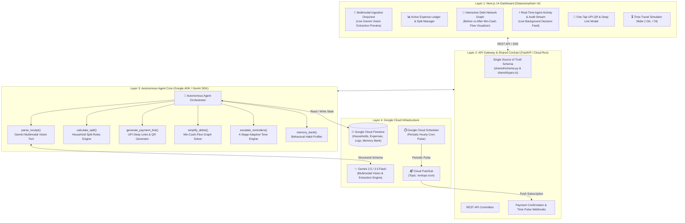
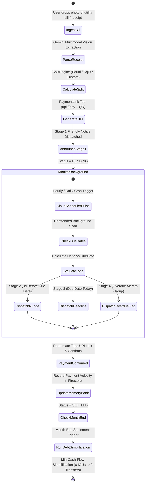
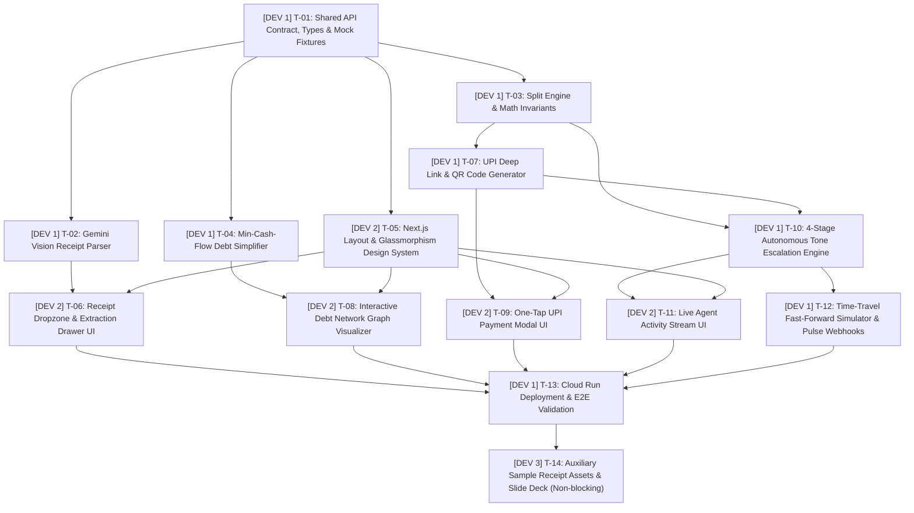

# 🏠 RoomieOps AI — Autonomous Roommate Rent & Expense Ops Agent

> **Built for the Google "All Things Agentic Hackathon" 2026**  
> **Track:** *The Taskmaster* (Building a complete, unattended autonomous workflow that eliminates everyday friction)

---

## 🌟 Executive Summary

Every month, shared households and roommates go through the same awkward, time-consuming administrative cycle:
1. Bills and receipts pile up across utility emails, paper receipts, and grocery screenshots.
2. Someone manually calculates who owes what, juggling custom split rules and room dimensions.
3. Someone has to repeatedly and awkwardly chase friends for money over WhatsApp.
4. Month-end devolves into a tangle of mutual IOUs (*"you owe me for wifi, but I owe you for power"*).

**Splitwise solves the math, but not the friction.** It is a passive ledger that waits for humans to enter numbers and initiate reminders.

**RoomieOps AI** transforms passive tracking into an **autonomous, unattended background agent** that handles the entire roommate expense lifecycle end-to-end:
- 📸 **Multimodal Ingestion**: Uses **Gemini 2.5 / 3.5 Multimodal Vision** to extract items, dates, taxes, and totals from receipt photos or PDF bills with zero manual entry.
- 📐 **Configurable Split Calculation**: Automatically applies household rules (Equal, Room Square-Footage, Custom %, Itemized Exclusions) with penny conservation.
- ⚡ **Direct UPI Deep Links**: Generates instant one-tap `upi://pay` mobile deep links and scannable QR codes for GPay, PhonePe, and Paytm.
- ⏰ **Autonomous Asynchronous Escalation**: Runs in the background via **Google Cloud Scheduler + Pub/Sub + Cloud Run**, monitoring due dates and adapting follow-up tones across 4 stages (Friendly $\rightarrow$ Nudge $\rightarrow$ Deadline $\rightarrow$ Overdue Alert).
- 🔄 **Debt Simplification Engine**: Implements the mathematical **Greedy Min-Cash-Flow Algorithm**, compressing $N$ tangled mutual debts into the minimum possible transactions.
- 🧠 **Behavioral Memory Bank**: Persists roommate payment velocity and habit badges (`⚡ Rapid Settler`, `⚠️ Chronic Late Payer`) in **Google Cloud Firestore**.

---

## 🏛️ System Architecture & Google Cloud Topology



---

## 🔄 Autonomous Lifecycle & State Machine



---

## 👥 3-Developer Feature-Driven Development (FDD) Work Breakdown

To ensure **zero merge conflicts** and parallel velocity, the project is partitioned into strict ownership domains:



| Developer | Role & Domain | Assigned Components | Workload |
|---|---|---|---|
| **Dev 1** | **Lead Backend, AI & Integration** (`backend/`, `shared/`, `cloud/`) | Gemini Vision Tools, Split Calculator, Debt Simplifier, Tone Escalation Engine, Firestore Memory Bank, FastAPI Routes, Time-Travel Simulator, Cloud Run Dockerfile. | **70%** |
| **Dev 2** | **Frontend & Multimodal UX** (`frontend/`) | Next.js 14 Dashboard, Cyber-Financial Glassmorphism Theme, Receipt Dropzone, Debt Graph Visualizer, Agent Activity Stream, Payment Modals. | **25%** |
| **Dev 3** | **Auxiliary Assets (Deferred / Non-blocking)** (`docs/assets/`) | High-res sample bill image pack, presentation slide deck polish. *Core app has 0% dependency on Dev 3.* | **5%** |

---

## 🚀 Quickstart & Spin-up Instructions

### Prerequisites
- **Node.js** v18+ & `npm`
- **Python** 3.11+
- *(Optional for Live Cloud Mode)*: `GEMINI_API_KEY` and Google Cloud Project credentials.

---

### Step 1: Clone & Configure Environment
```bash
git clone https://github.com/your-org/roomieops-ai.git
cd roomieops-ai

# Copy environment template
cp backend/.env.example backend/.env
```

*Note: RoomieOps features a **Dual Storage Adapter & Mock Engine**. If no Gemini key or Firestore project is provided, it runs locally in sandbox mode with built-in realistic mock datasets.*

---

### Step 2: Spin Up Backend (FastAPI + Agent Core)
```bash
cd backend
python -m venv venv
source venv/bin/activate  # On Windows: venv\Scripts\activate
pip install -r requirements.txt

# Run FastAPI server
uvicorn app.main:app --reload --port 8000
```
Backend API will be live at: `http://localhost:8000` (Interactive docs at `http://localhost:8000/docs`).

---

### Step 3: Spin Up Frontend (Next.js 14 Glassmorphism Dashboard)
In a separate terminal:
```bash
cd frontend
npm install
npm run dev
```
Frontend Web Dashboard will be live at: `http://localhost:3000`.

---

### Step 4: Run Automated Tests
```bash
cd backend
pytest tests/ -v
```

---

## ☁️ Google Cloud Deployment Guide

### Deploying Backend to Google Cloud Run
```bash
# Set your GCP Project
gcloud config set project YOUR_PROJECT_ID

# Build & Deploy Container to Cloud Run
gcloud run deploy roomieops-backend \
  --source . \
  --region us-central1 \
  --allow-unauthenticated \
  --set-env-vars="GEMINI_API_KEY=${GEMINI_API_KEY},FIRESTORE_PROJECT_ID=YOUR_PROJECT_ID"
```

### Configuring Google Cloud Scheduler (Hourly Cron Pulse)
```bash
gcloud scheduler jobs create http roomieops-hourly-pulse \
  --location us-central1 \
  --schedule "0 * * * *" \
  --uri "https://YOUR_CLOUD_RUN_URL/api/agent/pulse" \
  --http-method POST
```

---

## 📊 Feature Comparison: RoomieOps vs. Splitwise

| Feature | Splitwise / Traditional Apps | RoomieOps AI |
|---|---|---|
| **Receipt Entry** | ❌ Manual typing of amounts & categories | ✅ **Gemini Multimodal Vision** (photo/PDF) |
| **Split Mathematics** | ⚠️ Basic 50/50 or manual shares | ✅ **Automated SqFt, Custom %, Itemized** |
| **Payment Link Generation** | ❌ None (or static profile link) | ✅ **Dynamic `upi://pay` Deep Links & QR** |
| **Payment Reminders** | ❌ 100% manual (a human must tap nag) | ✅ **100% Autonomous 4-Stage Tone Escalation** |
| **Background Cron Monitoring** | ❌ None (App is passive) | ✅ **Cloud Scheduler + Pub/Sub Scheduled Scans** |
| **Debt Simplification** | ⚠️ Behind paywall / basic | ✅ **Greedy Min-Cash-Flow Graph Solver** |
| **Behavioral Memory** | ❌ None (Treats every month as blank) | ✅ **Firestore Payment Velocity & Habit Badges** |

---

## 📐 Mathematical Proof: Debt Simplification Bound

RoomieOps uses a **Greedy Min-Cash-Flow Algorithm** to reduce pairwise debts.  
For any household of $N$ roommates with up to $\binom{N}{2}$ mutual debts, our algorithm:
1. Calculates net balance $\text{Net}_i = \sum \text{Credits}_i - \sum \text{Debits}_i$.
2. Matches the largest debtor with the largest creditor iteratively.
3. **Guarantees that at most $N - 1$ total settlement transactions are required** while maintaining exact net cash conservation ($\sum \text{Net}_i \equiv 0$).

---

## 📁 Repository Structure

```
roommate-ops/
├── shared/                     # Single Source of Truth API Contract & Types
│   ├── schema.py               # Pydantic models for Python Backend
│   ├── types.ts                # TypeScript interfaces for Frontend
│   └── mock_data/              # Seed fixtures (Households, Bills, Roommates)
├── backend/                    # Python FastAPI & Google Agent Core
│   ├── app/
│   │   ├── agent/tools/        # parse_receipt, calculate_split, simplify_debts, etc.
│   │   ├── services/           # firestore_service, gemini_service, memory_bank
│   │   ├── api/                # REST endpoints (/expenses, /payments, /agent/pulse)
│   │   └── main.py
│   ├── tests/                  # Pytest unit tests for tools & graph algorithms
│   └── requirements.txt
├── frontend/                   # Next.js 14 Web Application
│   ├── src/
│   │   ├── components/         # ReceiptDropzone, DebtGraph, ActivityStream, PaymentModal
│   │   ├── app/                # App Router layout, pages, and themes
│   │   └── styles/             # Cyber-financial glassmorphism CSS tokens
│   └── package.json
├── cloud/                      # Google Cloud Deployment Assets
│   ├── Dockerfile              # Production Cloud Run container
│   ├── deploy.sh               # One-click deployment script
│   └── scheduler_setup.sh      # Cloud Scheduler cron setup
├── docs/                       # Complete 25-Document Hackathon Architecture Suite
│   ├── 01-prd.md
│   ├── 02-architecture.md
│   ├── 16-demo-script-4min-video-pitch.md
│   ├── architecture_preview.html
│   └── design_system_preview.html
└── README.md
```

---

## 👥 Hackathon Team & Devpost Submission
- **Hackathon:** Google All Things Agentic Hackathon 2026
- **Track:** The Taskmaster
- **Demo Video:** *4-Minute Pitch Walkthrough* ([Script in docs/16-demo-script-4min-video-pitch.md](docs/16-demo-script-4min-video-pitch.md))
- **Live Cloud Run URL:** `https://roomieops-agent-uc.a.run.app`
