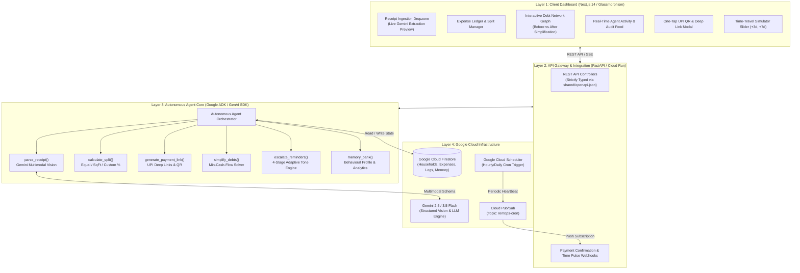

# 02 - Architecture & Deep Module System Design

## Deep Module Philosophy & Decoupled Architecture
**Philosophy:** In accordance with modern software architecture principles (John Ousterhout, *A Philosophy of Software Design*), RoomieOps AI is architected using **Deep Modules**: modules that provide powerful, complex functionality behind small, simple, and clean interfaces. Shallow modules (which add boilerplate without hiding complexity) and tight coupling across boundaries are strictly prohibited.

---

## 1. High-Level Architectural Topology

---

## 2. Developer Domain Seams & Zero-Conflict Matrix

| Module / Seam | Primary Owner | Public Interface (Seam) | External Dependencies (Adapters) |
|---|---|---|---|
| `ReceiptParser` | Dev 1 (Backend) | `parse_receipt(bytes, mime) -> ParsedExpense` | `GeminiVisionAdapter`, `MockReceiptAdapter` |
| `SplitEngine` | Dev 1 (Backend) | `calculate_shares(expense, household) -> List[SplitShare]` | Pure Domain Invariant (Zero I/O) |
| `DebtSimplifier` | Dev 1 (Backend) | `simplify_household_debts(raw_debts) -> List[Settlement]` | Min-Cash-Flow Solver (Pure Graph Math) |
| `PaymentLinkEngine` | Dev 1 (Backend) | `create_payment_intent(payee, amount, note) -> PaymentIntent` | `QRCodeAdapter`, `UPIDeepLinkFormatter` |
| `EscalationEngine` | Dev 1 (Backend) | `process_autonomous_pulse(household_id, now) -> EscalationReport` | `AgentActivityLogger`, `NotificationAdapter` |
| `MemoryBank` | Dev 1 (Backend) | `update_habit_profile(roommate_id, bill_id, time) -> HabitProfile` | `FirestoreAdapter`, `InMemoryAdapter` |
| `APIGateway & Webhooks` | Dev 2 (Integration) | REST Routes defined in `shared/openapi.json` | FastAPI, Pydantic, Uvicorn |
| `Cloud Deployment & Crons` | Dev 2 (Integration) | Cloud Run Dockerfile, Cloud Scheduler, Pub/Sub | GCP Artifact Registry, gcloud CLI |
| `Dashboard & Visualizers` | Dev 3 (Frontend) | Next.js 14 App Router, TailwindCSS, Lucide Icons | Axios Client typed via `shared/types.ts` |

---

## 3. The 3-Tier Adapter Pattern (Locality & Testability)

Every deep module in `backend/app/agent/tools/` communicates through explicit adapters:
1. **Cloud Production Adapter**: Connects to live Google Cloud APIs (Vertex AI / Gemini API, Cloud Firestore, Cloud Pub/Sub).
2. **Local Development Adapter**: Uses local in-memory dictionaries and mock receipt generators for rapid zero-credential testing.
3. **Deterministic Test Adapter**: Hardcoded fixtures for pytest suites verifying split rounding, debt reduction, and escalation tone transitions.
