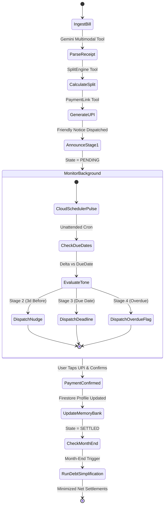

# 03 - Agent Specification & Google Agent Framework (ADK / GenAI SDK)

## 1. Agent Mission & Autonomous Mode of Operation
The **RoomieOps Agent** is an autonomous operational assistant built using the **Google GenAI SDK** / **Google Agent Development Kit (ADK)** and powered by **Gemini 2.5 / 3.5 Flash**. 

Unlike conversational chatbots that simply generate conversational text, RoomieOps executes multi-step operational workflows:
1. Multimodal receipt ingestion & validation.
2. Exact split computation across roommates.
3. Creation of mobile-ready UPI deep links.
4. Autonomous due-date monitoring on a scheduled cron pulse.
5. Multi-stage tone escalation and nudging.
6. Graph-based debt simplification at month-end.

---

## 2. Tool Calling Definitions (ADK / GenAI SDK Compatible)

### Tool 1: `parse_receipt`
- **Description:** Parses an image or PDF document of a receipt/utility bill using Gemini Multimodal vision and returns a structured expense schema.
- **Parameters:**
  - `file_bytes` (bytes): Raw binary data of the uploaded image/PDF.
  - `mime_type` (string): e.g. `image/jpeg`, `image/png`, `application/pdf`.
- **Output:** `ParsedExpense` (Vendor, Date, Category, Total Amount, Tax, Line Items).

### Tool 2: `calculate_split`
- **Description:** Computes exact individual shares for all roommates in a household based on the selected split rule.
- **Parameters:**
  - `total_amount` (float): Total bill amount.
  - `split_rule` (enum): `EQUAL`, `ROOM_AREA`, `PERCENTAGE`, `ITEMIZED`.
  - `roommates` (list): Array of roommate profiles including ID, room square footage, and custom percentage.
  - `exclusions` (optional dict): Mapping of items excluded for specific roommates.
- **Output:** `List[SplitShare]` with exact penny-rounded amounts satisfying $\sum \text{Shares} \equiv \text{Total}$.

### Tool 3: `generate_payment_link`
- **Description:** Formats a mobile-ready UPI deep link and renders a base64 QR code for one-tap payments.
- **Parameters:**
  - `payee_vpa` (string): Payee UPI ID (e.g. `alex@okaxis`).
  - `payee_name` (string): Payee legal name.
  - `amount` (float): Amount to request.
  - `transaction_note` (string): Bill description (e.g. `Wifi Bill Oct - Flat 402`).
- **Output:** `PaymentIntent` (`deep_link`, `qr_code_base64`, `amount`, `payee`).

### Tool 4: `simplify_debts`
- **Description:** Runs the Greedy Min-Cash-Flow algorithm over the household debt graph to compress $N$ mutual debts into the minimal number of direct settlements.
- **Parameters:**
  - `raw_debts` (list): Array of `{ debtor_id, creditor_id, amount }`.
- **Output:** `List[Settlement]` (`from_roommate`, `to_roommate`, `amount`, `upi_deep_link`).

### Tool 5: `escalate_reminders`
- **Description:** Analyzes unpaid split shares against the current time and generates tone-escalated follow-up notices.
- **Parameters:**
  - `unpaid_shares` (list): Outstanding split shares.
  - `current_time` (datetime): Reference timestamp (supports time-travel simulation).
- **Output:** `EscalationReport` containing actions taken, tone stage assigned (`STAGE_1_ANNOUNCE`, `STAGE_2_NUDGE`, `STAGE_3_DEADLINE`, `STAGE_4_OVERDUE`), and generated message strings.

### Tool 6: `memory_bank`
- **Description:** Retrieves and updates long-term behavioral profiles in Firestore (payment velocity, on-time rate, chronic late-payer badges).
- **Parameters:**
  - `roommate_id` (string): Target roommate ID.
  - `action` (enum): `GET_PROFILE`, `RECORD_PAYMENT`, `GET_HOUSEHOLD_SUMMARY`.
- **Output:** `HabitProfile` (`avg_settlement_hours`, `on_time_ratio`, `habit_badge`).

---

## 3. Autonomous Execution Loop (Taskmaster Workflow)

