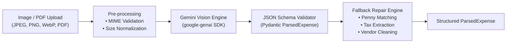

# 05 - Multimodal Vision & Receipt Ingestion Engine

## 1. Engine Objective & Ingestion Pipeline
The **Multimodal Vision Engine** transforms raw, unstructured receipt images, utility bill PDFs, and mobile payment screenshots into strongly-typed `ParsedExpense` entities using **Gemini 2.5 / 3.5 Multimodal** with strict JSON Schema constraints.

---

## 2. Ingestion Pipeline Stages



---

## 3. Gemini Vision System Prompt & Schema Specification

### System Prompt Template
```text
You are the RoomieOps Multimodal Receipt Ingestion Specialist.
Analyze the provided document (receipt, invoice, utility bill, or screenshot) and extract all financial details with strict precision.

Rules:
1. Extract the exact merchant/vendor name. If ambiguous, extract the utility provider or store header.
2. Determine the category: RENT, ELECTRICITY, GROCERIES, WIFI, MAINTENANCE, or OTHER.
3. Extract the total invoice amount as a numeric float.
4. Extract the bill date (YYYY-MM-DD). If no date is visible, use the current date.
5. Extract individual line items with item name, quantity (if available), and line item total.
6. Extract tax and surcharge amounts if explicitly listed.
7. Return ONLY a valid JSON object matching the requested schema. No markdown formatting, no conversational preamble.
```

### JSON Schema Output Structure
```json
{
  "vendor": "Adani Electricity Mumbai Ltd",
  "category": "ELECTRICITY",
  "total_amount": 2450.00,
  "tax_amount": 180.00,
  "bill_date": "2026-08-25",
  "due_date": "2026-09-05",
  "items": [
    {
      "name": "Energy Charges (Units: 340 kWh)",
      "amount": 2100.00,
      "category": "UTILITIES"
    },
    {
      "name": "Fuel Adjustment Charge & Duty",
      "amount": 350.00,
      "category": "TAX"
    }
  ],
  "confidence_score": 0.98
}
```

---

## 4. Fallback & Deterministic Repair Layer
If the raw OCR/LLM output contains small discrepancies:
1. **Sum Matching Check**: If $\sum \text{LineItems} + \text{Tax} \neq \text{TotalAmount}$, the repair layer balances line items or flags an itemized discrepancy warning.
2. **Date Extraction Fallback**: If the receipt lacks an explicit due date, the engine defaults `due_date` to `bill_date + 7 days`.
3. **Mock Data Fixture Fallback**: If running offline or in demo sandbox mode, the engine provides built-in sample receipts (Rent, Electricity, Wifi, Groceries).
