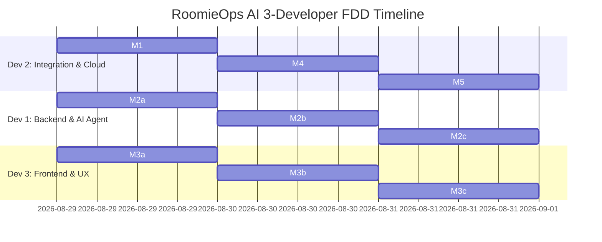

# 10 - 3-Developer FDD Development Roadmap & Milestones

This roadmap outlines the exact execution sequence for our 3-developer team across 5 Feature-Driven Development (FDD) milestones.

---

## Team Assignment Matrix

---

## Milestone Breakdown & Acceptance Criteria

### Milestone 1: Shared API Contract & Mock Fixtures (Lead: Dev 2)
- [ ] Define `shared/openapi.json` with all schemas and response types.
- [ ] Generate TypeScript interfaces in `shared/types.ts` and Pydantic models in `shared/schema.py`.
- [ ] Create mock data fixtures in `shared/mock_data/` (4 roommates, 4 sample receipts).
- **Exit Criteria**: Dev 1 and Dev 3 can start building simultaneously with zero blocking.

### Milestone 2: Agent Tools & Core Algorithms (Lead: Dev 1)
- [ ] Implement `parse_receipt.py` using Gemini Multimodal vision with JSON output.
- [ ] Implement `split_calculator.py` with Equal, SqFt, and Percentage split rules.
- [ ] Implement `payment_links.py` generating `upi://pay` strings and QR code base64.
- [ ] Implement `debt_simplifier.py` with Greedy Min-Cash-Flow algorithm.
- [ ] Implement `escalation_engine.py` with 4-stage tone progression.
- [ ] Implement `memory_bank.py` with Firestore dual adapter and habit badges.
- **Exit Criteria**: 100% test pass rate in `pytest backend/tests/`.

### Milestone 3: Next.js Glassmorphism Frontend (Lead: Dev 3)
- [ ] Implement glassmorphism layout, header, and live agent status pill.
- [ ] Implement `ReceiptDropzone` with sample receipt picker and Gemini extraction preview.
- [ ] Implement `DebtGraph` with animated "Before (6 IOUs)" vs "After (2 Transfers)" visualizer.
- [ ] Implement `AgentActivityStream` showing chronological autonomous agent actions.
- [ ] Implement `PaymentModal` with clickable UPI deep links and QR codes.
- [ ] Implement `TimeTravelSlider` for fast-forwarding time in the demo.
- **Exit Criteria**: Frontend functions end-to-end against mock client or local backend.

### Milestone 4: Integration, Webhooks & Time-Travel Simulator (Lead: Dev 2)
- [ ] Wire FastAPI route controllers in `backend/app/api/` to backend agent tools.
- [ ] Wire `/api/agent/pulse` webhook and `/api/agent/simulate-days` time-travel endpoint.
- [ ] Verify live data synchronization between Next.js frontend and FastAPI backend.
- **Exit Criteria**: Full workflow operates from receipt upload to payment and settlement.

### Milestone 5: Google Cloud Deployment & Submission Package (All Devs)
- [ ] Build Cloud Run container using `cloud/Dockerfile` and deploy via `cloud/deploy.sh`.
- [ ] Configure Google Cloud Scheduler cron topic in `cloud/scheduler_setup.sh`.
- [ ] Record 4-minute demo video following `docs/16-demo-script-4min-video-pitch.md`.
- [ ] Finalize `README.md` spin-up instructions and submit to Devpost.
