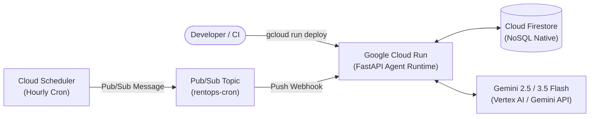

# 11 - Google Cloud Deployment & Infrastructure Guide

## 1. Google Cloud Architecture & Services

RoomieOps AI is deployed on Google Cloud to prove **Production Readiness (30% weight)** using standard serverless infrastructure:



---

## 2. Dockerfile for Cloud Run (`cloud/Dockerfile`)

```dockerfile
# Multi-stage lightweight Python runtime
FROM python:3.11-slim as base

WORKDIR /app
ENV PYTHONUNBUFFERED=1 \
    PYTHONDONTWRITEBYTECODE=1 \
    PORT=8080

RUN apt-get update && apt-get install -y --no-install-recommends \
    build-essential curl && \
    rm -rf /var/lib/apt/lists/*

COPY backend/requirements.txt .
RUN pip install --no-cache-dir -r requirements.txt

COPY backend/ .
COPY shared/ /app/shared/

EXPOSE 8080
CMD ["uvicorn", "app.main:app", "--host", "0.0.0.0", "--port", "8080"]
```

---

## 3. Google Cloud CLI Deployment Commands (`cloud/deploy.sh`)

```bash
#!/usr/bin/env bash
set -e

PROJECT_ID="roomieops-agentic-hackathon"
REGION="us-central1"
SERVICE_NAME="roomieops-backend"

echo "==> Configuring GCP Project: $PROJECT_ID"
gcloud config set project $PROJECT_ID

echo "==> Deploying Agent Backend to Google Cloud Run..."
gcloud run deploy $SERVICE_NAME \
  --source . \
  --region $REGION \
  --allow-unauthenticated \
  --set-env-vars="GEMINI_API_KEY=${GEMINI_API_KEY},FIRESTORE_PROJECT_ID=${PROJECT_ID}"

echo "==> Configuring Cloud Scheduler Hourly Pulse Trigger..."
gcloud scheduler jobs create http roomieops-hourly-pulse \
  --location $REGION \
  --schedule "0 * * * *" \
  --uri "$(gcloud run services describe $SERVICE_NAME --region $REGION --format='value(status.url)')/api/agent/pulse" \
  --http-method POST

echo "==> Deployment Complete! Service live on Cloud Run."
```
