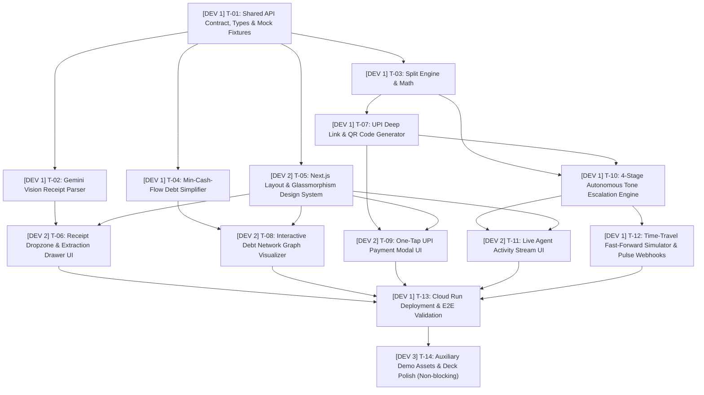

# 22 - Actionable Issues Backlog & Realigned Ticket Graph

## Realignment Notice: Team Allocation Update
- **Dev 1 (Lead Full-Stack / AI & Integration Engine)**: Owns `backend/`, `shared/`, and `cloud/`. Builds the AI agent, tools, algorithms, API gateway, and cloud setup.
- **Dev 2 (Frontend & UI Component Specialist)**: Owns `frontend/`. Builds the Next.js glassmorphic dashboard, multimodal dropzone, debt graph visualizer, activity stream, and payment modals.
- **Dev 3 (Auxiliary / Polish - Low Dependency)**: Minimal non-blocking work (sample receipt image assets, static documentation polish, presentation slides). Core app operates with 0% dependency on Dev 3.

---

## 1. Updated Task Graph & Ticket Allocation

---

## 2. Active Ticket Frontier

| Ticket | Assigned Dev | Domain / Files | Status |
|---|---|---|---|
| **T-01** | **Dev 1** | `shared/schema.py`, `shared/types.ts`, `shared/mock_data/` | **Ready to Build** |
| **T-02** | **Dev 1** | `backend/app/agent/tools/receipt_parser.py` | **Ready to Build** |
| **T-03** | **Dev 1** | `backend/app/agent/tools/split_calculator.py` | **Ready to Build** |
| **T-04** | **Dev 1** | `backend/app/agent/tools/debt_simplifier.py` | **Ready to Build** |
| **T-05** | **Dev 2** | `frontend/` (Next.js layout, CSS tokens, shell) | **Ready to Build** |
| **T-07** | **Dev 1** | `backend/app/agent/tools/payment_links.py` | **Ready to Build** |
| **T-10** | **Dev 1** | `backend/app/agent/tools/escalation_engine.py` | **Ready to Build** |
| **T-12** | **Dev 1** | `backend/app/api/routes.py`, `backend/app/main.py` | **Ready to Build** |
| **T-13** | **Dev 1** | `cloud/Dockerfile`, `cloud/deploy.sh` | **Ready to Build** |
| **T-14** | **Dev 3** | `docs/assets/`, presentation deck | **Auxiliary (Postponed)** |
