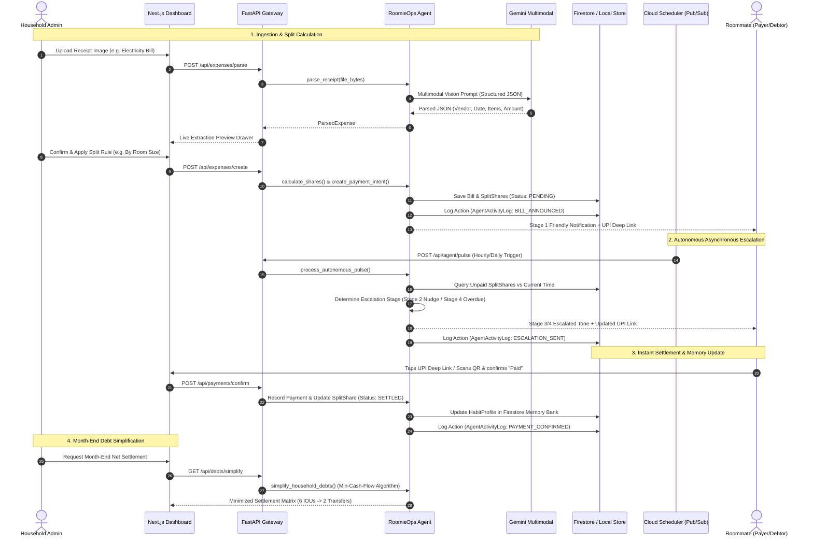

# Architecture Specification: RoomieOps AI

This document defines the deep-module architecture, interface boundaries, seams, adapters, and data pipelines for **RoomieOps AI** following the `codebase-design` principles.

---

## 1. Architectural Principles & Deep Modules

In this codebase:
- A **module** is deep when a large amount of complex behavior sits behind a compact, clean interface.
- A **seam** is a public boundary where tests verify observable behavior without reaching into private internals.
- An **adapter** connects a clean seam to an external service or implementation detail (e.g. Gemini API, Firestore, Pub/Sub, In-Memory mock).
- **Locality** is preserved: callers do not orchestrate fragile multi-step mutations; deep modules own their entire domain invariants.

---

## 2. Core Deep Modules & Seams

```mermaid
classDiagram
    class ReceiptParserModule {
        <<Deep Module>>
        +parse_receipt(file_bytes, mime_type) ParsedExpense
    }
    class SplitEngineModule {
        <<Deep Module>>
        +calculate_shares(expense, household) List~SplitShare~
    }
    class DebtSimplifierModule {
        <<Deep Module>>
        +simplify_household_debts(debt_graph) List~Settlement~
    }
    class PaymentLinkModule {
        <<Deep Module>>
        +create_payment_intent(payee, amount, note) PaymentIntent
    }
    class EscalationEngineModule {
        <<Deep Module>>
        +process_autonomous_pulse(household_id, current_time) List~EscalationAction~
    }
    class MemoryBankModule {
        <<Deep Module>>
        +record_settlement(roommate_id, bill_id, settle_time) HabitProfile
        +get_household_habits(household_id) List~HabitProfile~
    }
```



### Module 1: `ReceiptParserModule`
- **Location**: `backend/app/agent/tools/receipt_parser.py`
- **Interface**:
  ```python
  def parse_receipt(file_bytes: bytes, mime_type: str) -> ParsedExpense
  ```
- **Depth**: Hides Gemini Multimodal prompt formatting, image encoding, JSON schema constraint injection, repair parsing of malformed LLM outputs, line item aggregation, tax calculation, and vendor normalization.
- **Seam**: Returns a strongly-typed `ParsedExpense` Pydantic model.
- **Adapters**:
  - `GeminiVisionAdapter`: Calls `gemini-2.5-flash` / `gemini-3.5-flash` using `google-genai` / `google-generativeai`.
  - `MockReceiptAdapter`: Returns pre-validated deterministic expense schemas for offline test suites.

### Module 2: `SplitEngineModule`
- **Location**: `backend/app/agent/tools/split_calculator.py`
- **Interface**:
  ```python
  def calculate_shares(expense: Expense, household: Household) -> List[SplitShare]
  ```
- **Depth**: Validates total penny matching ($\sum \text{Shares} == \text{Total}$), handles rounding fractions without losing currency units, applies room area ratios, custom percentage matrices, and per-item exclusion filters.
- **Seam**: Pure functional calculation seam with zero side effects.

### Module 3: `DebtSimplifierModule`
- **Location**: `backend/app/agent/tools/debt_simplifier.py`
- **Interface**:
  ```python
  def simplify_household_debts(raw_debts: List[RawDebt]) -> List[Settlement]
  ```
- **Depth**: Implements the Greedy Min-Cash-Flow graph solver, compresses $O(N^2)$ mutual IOUs down to $\le N-1$ transactions, guarantees net cash conservation $\sum \text{Net} == 0$, and detects circular debts.
- **Seam**: Input is raw pairwise debts; output is the minimal canonical `Settlement` array.

### Module 4: `PaymentLinkModule`
- **Location**: `backend/app/agent/tools/payment_links.py`
- **Interface**:
  ```python
  def create_payment_intent(payee_vpa: str, payee_name: str, amount: float, note: str) -> PaymentIntent
  ```
- **Depth**: Formats valid RFC-compliant UPI deep-link URI (`upi://pay`), validates VPA handle formats, generates Base64-encoded PNG QR code matrices, and constructs web fallbacks.
- **Seam**: Returns `PaymentIntent(deep_link=..., qr_code_base64=..., amount=..., payee=...)`.

### Module 5: `EscalationEngineModule`
- **Location**: `backend/app/agent/tools/escalation_engine.py`
- **Interface**:
  ```python
  def process_autonomous_pulse(household_id: str, simulated_now: datetime) -> EscalationReport
  ```
- **Depth**: Queries outstanding unpaid split shares, calculates temporal delta against `DueDate`, evaluates historical habit profiles, selects the deterministic 4-stage tone template (Friendly $\rightarrow$ Nudge $\rightarrow$ Deadline $\rightarrow$ Overdue Flag), dispatches notifications, and logs immutable entries in the `AgentActivityLog`.
- **Seam**: Invoked by Cloud Scheduler / PubSub webhooks or manual demo time-travel triggers.

### Module 6: `MemoryBankModule`
- **Location**: `backend/app/agent/tools/memory_bank.py`
- **Interface**:
  ```python
  def update_habit_profile(roommate_id: str, bill_id: str, payment_timestamp: datetime) -> HabitProfile
  def get_household_analytics(household_id: str) -> HouseholdAnalytics
  ```
- **Depth**: Computes rolling settlement velocity (hours elapsed), calculates on-time payment ratio, assigns dynamic behavioral badges (`⚡ Rapid Settler`, `⚠️ Chronic Late Payer`), and aggregates category spend distribution.

---

## 3. End-to-End System Dataflow


